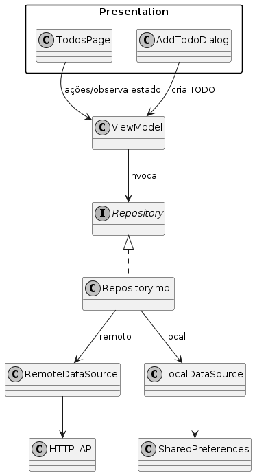

# ARCH — Estrutura e decisões

## Estrutura final (lib/)
```
lib/
  core/
    domain/
      app_error.dart
    presentation/
      app_root.dart
  features/
    todos/
      domain/
        entities/
          todo.dart
        repositories/
          todo_repository.dart
      data/
        datasources/
          todo_local_datasource.dart
          todo_remote_datasource.dart
        models/
          todo_model.dart
        repositories/
          todo_repository_impl.dart
      presentation/
        pages/
          todos_page.dart
        viewmodels/
          todo_viewmodel.dart
        widgets/
          add_todo_dialog.dart
  main.dart
```

## Fluxo de dependências
- UI (Widgets) → ViewModel → Domain Repository → Data (RepositoryImpl → DataSources)
- Data escolhe a fonte (remota/local). Domain não conhece detalhes de infraestrutura.
- Presentation não conhece HTTP/SharedPreferences; apenas conversa com o domínio.

## Diagrama do fluxo


## Justificativa da estrutura
- Adotamos o padrão feature-first para escalar o projeto por áreas funcionais.
- Para a feature “todos”, aplicamos camadas claras: presentation, domain e data.
- A camada core concentra artefatos transversais (ex.: AppRoot e tipos de erro).
- O fluxo de dependências é unidirecional e estável, reduzindo acoplamento.

## Decisões de responsabilidade
- Validação: mínima no ViewModel (ex.: título vazio) para feedback imediato.
- Parsing JSON: exclusivo em data/models (TodoModel) e datasources remotos.
- Persistência simples (última sincronização): em data/datasources locais.
- Repository: centraliza a decisão entre remoto/local e retorna entidades de domínio.
- ViewModel: expõe estado, coordena casos de uso e notifica UI; não usa BuildContext.
- UI: apenas renderiza estado e despacha intenções; não acessa infraestrutura.
